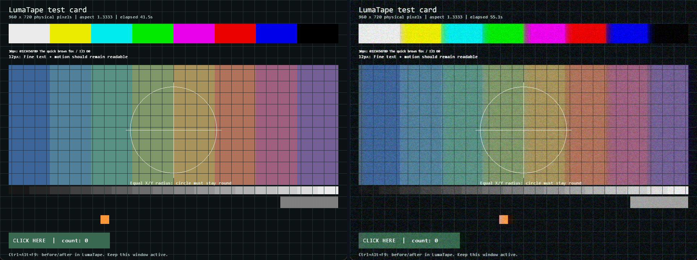

# LumaTape

[Download for Windows](https://github.com/aiwaki/lumatape/releases/latest) · [Documentation](docs/README.en.md) · [Русский](README.md)

CRT and VHS for games: TV scanlines, a soft glow, and videotape distortion.
LumaTape overlays effects on a game window and can give the screen rounded
corners or a curved shape, like a vintage TV.

Original test scene on the left; with a LumaTape effect on the right.
